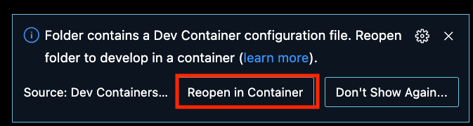
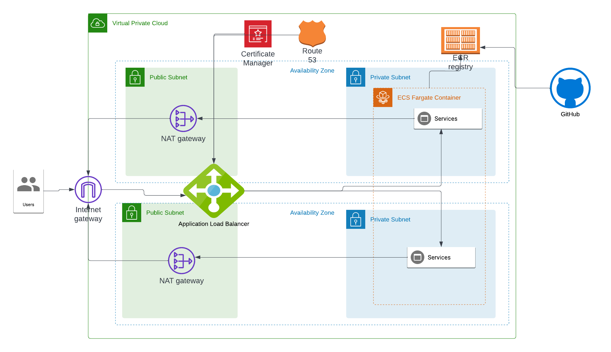

# Overview

This repository contains a simple React frontend, an Express backend that the
frontend connects to, infrastructure code to provide a runtime environment, and
a build pipeline to create deployable artifacts.

>The live application is reachable at
[https://lightfeather.bananalab.dev](https://lightfeather.bananalab.dev)

## Environment setup

This project uses
[Devcontainers](https://code.visualstudio.com/docs/devcontainers/containers)
to provide a consistent developer experience regardless of opeating system.
To open the project in the devcontainer using VSCode select "Reopen in
container" from the dialog.



The devcontainer includes all tools required to develop, build, and deploy the
application and infrastructure.

> In order to build and deploy the application and infrastructure you will need
AWS and Github credentials.  Ask you systems administrator to provide them.

## Development

There are two services defined: Frontend and Backend. To start these services
in development mode run these commands:

```bash
pushd backend
npm ci
npm start
popd
pushd frontend
npm ci
npm start
popd
```

This will open a browser to the frontend service on
[http://localhost:3000](http://localhost:3000)
With the services running you can modify their code and observe the changes in
the browser.

## Build

Production builds are performed by GitHub actions upon merge to `main` and
pushed to the docker registry on AWS where they can be deployed.

## Infrastructure



The infrastructure is defined in Terraform code found in the `infrastructure` directory.
> Additional Terraform modules referenced can be found in the
[terraform-modules repo](https://github.com/bananalab/terraform-modules)

### Infrastructure Deployment

The infrastructure can be deployed with these commands

```bash
cd infrastructure/aws
terraform init
terraform plan -out tfplan.out
```

Carefully review the plan output before proceeding to

```bash
terraform apply tfplan.out
```

## Application Deployment

There is currently no continuous deployment (CD) for the application so it must
be deployed with the following steps.

1. Commit and push code to the repository. This will cause the docker
containers to be built and pushed to the docker registry hosted on AWS.
2. Update the ECS Service by running

```bash
terraform taint aws_ecs_service.this
terraform plan -out tfplan.out
terraform apply tfplan.out
```

## Application Build System

The application consists of two docker images built by Github actions. The
build pipeline definition can be found in
`.github/workflows/build_and_push.yml`. The build pipeline requires a number of
 inputs:

`AWS_ACCOUNT_ID`: Account number of AWS account to deploy to. Used in
authentication to ECR.

`AWS_REGION`: AWS region to deploy to. Used in authentication to ECR.

`AWS_ROLE_ARN`: The IAM role to assume while pushing to ECR.

`API_URL`: The url of the backend API.  This is used in the frontend build
process.

These are configured as `Repository Secrets` in the GitHub repo.

## TODOs

1. Tests and test automation.  There are currently no tests.
2. Application and infrastructure deployment automation.
